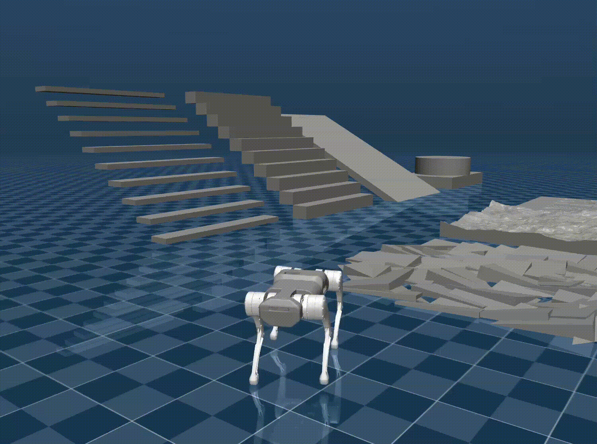

<div align="center">
  <h1 align="center">Gym to Mujoco</h1>
  <p align="center">
    <span> 🌎English </span> 
  </p>
</div>

<p align="center">
  <strong>This is a repository to infer reinforcement learning policies on Mujoco simulator.</strong> 
</p>
<div align="center">

</div>

## 📦 Installation and Configuration

### 1. Install Mujoco Simulator and Torch

Run the following command to install mujoco:

```bash
pip install mujoco
```

Run the following command to install torch

```bash
pip install torch torchvision torchaudio
```

### 2. Sim2Sim (Mujoco)

Run Sim2Sim in the Mujoco simulator:

```bash
python gym_to_mujoco.py {config_name}
```

#### Parameter Description
- `config_name`: Configuration file; default search path is `/configs/`.

#### Example: Running Trakr

```bash
python gym_to_mujoco.py trakr.yaml
```

#### ➡️ Replace Network Model

The default model is located at `policies/policy_1.pt`. Update the `policy_path` in the YAML configuration file accordingly.
